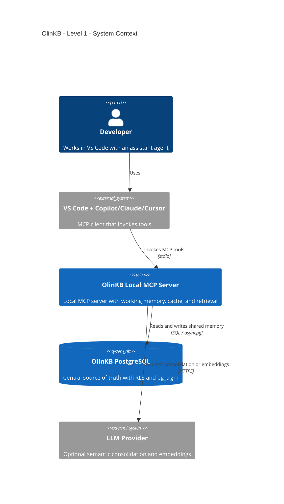
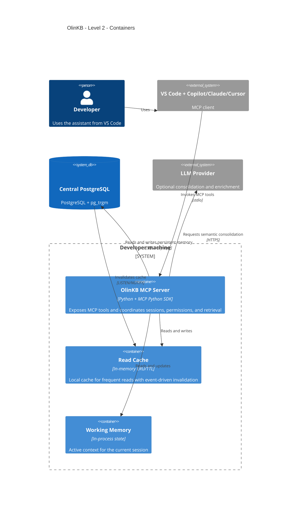
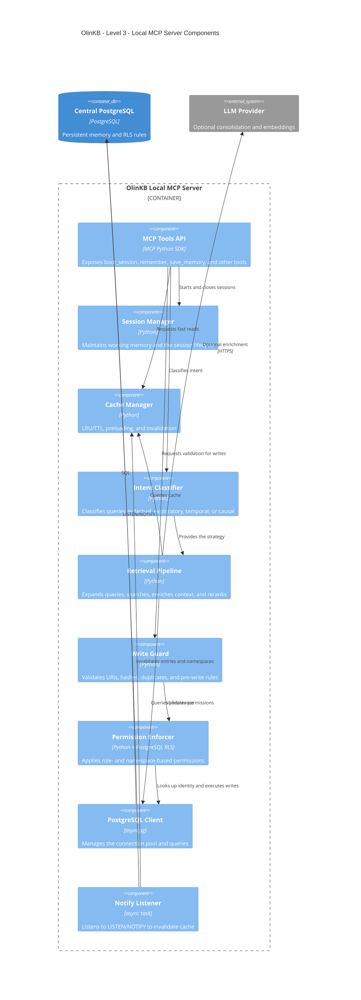
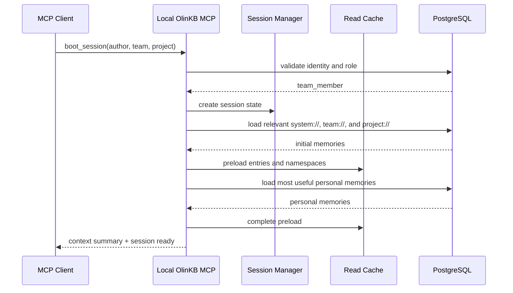
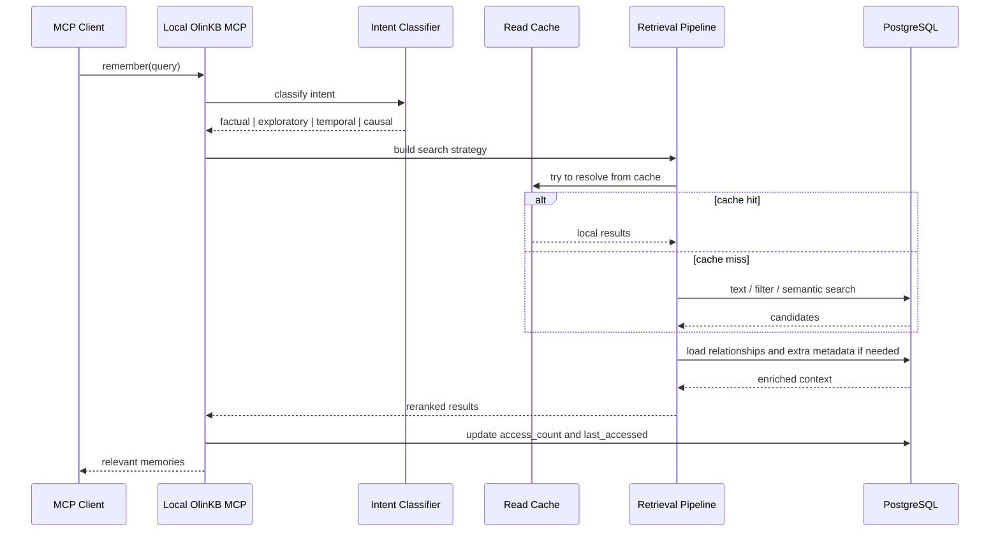
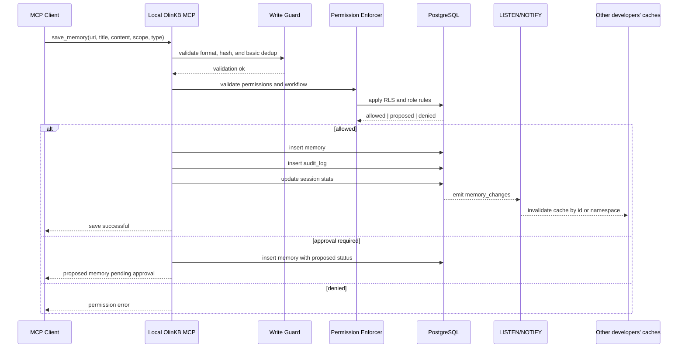

# OlinKB — C4 Architecture

## Executive Summary
OlinKB is a shared memory architecture for development teams where PostgreSQL becomes the single source of truth and each developer operates through a local MCP server. That local server maintains two things that make the day-to-day experience viable: session working memory and an in-memory read cache so that most reads do not depend on the network.

The important change compared to v1 is structural. v1 worked as personal memory or for very small teams because SQLite solves the local case well, but not the serious multi-user case. The current architecture moves shared persistence to PostgreSQL to gain real concurrency, native permissions with RLS, auditing, hybrid search, and a stronger foundation for scaling from a small team to an organization with multiple teams.

The goal is not to create another generic RAG system or another wiki with embeddings. The goal is to build a governed team memory that agents can query, with a clear separation between personal, project, team, organization, and session memory.

## Phase Note
In the current phase, OlinKB relies on standard PostgreSQL plus textual search with `pg_trgm`. Semantic search with `pgvector` is explicitly outside the current runtime and is considered a future enhancement for a later phase.

## System Goal
OlinKB must allow a development agent to:

- Retrieve team decisions, conventions, and procedures in real time.
- Maintain local working memory during the session without inflating the central database.
- Write new shared memory in a safe, auditable, and governed way.
- Start a new session with useful preloaded context through `boot_session`.
- Scale from a few developers to larger teams without rewriting the base architecture.

## Architectural Drivers
| Driver | What it requires |
|---|---|
| Real teams, not just a single developer | Central PostgreSQL instead of SQLite as shared storage |
| Low read latency | Local read cache with TTL and invalidation |
| Compatibility with Copilot/Claude/Cursor | Local MCP server over `stdio` |
| Security and governance | PostgreSQL RLS + roles + approval workflows |
| Useful context in every session | `boot_session` with relevant memory preloading |
| Search more useful than flat FTS | Intent-aware retrieval with a hybrid pipeline |
| Living memory instead of infinite accumulation | Forgetting engine with decay, TTL, and consolidation |
| Observability and traceability | `audit_log`, `sessions`, metrics, and access data |

## Constraints
| Constraint | Consequence |
|---|---|
| PostgreSQL is mandatory in the current architecture | There is no multi-backend support or sync with other engines |
| The MCP server runs locally for each developer | The experience is local, but writes go to the central backend |
| The local cache is not the source of truth | Every write must reach PostgreSQL |
| Offline mode does not cover writes | Partial offline support is tolerated only for working memory and cached reads |
| Embeddings are a later-phase enhancement | The MVP can start with keyword search and cache |

## Design Principles
1. PostgreSQL is the truth.
2. The cache accelerates; it does not decide.
3. Permissions are enforced in the database, not only in the application.
4. The session has working memory separate from persistent memory.
5. Shared memory needs governance, not just storage.
6. Search must use intent, not just textual matching.
7. Memory must be able to decay, consolidate, and be archived.
8. Every relevant change must be audited.

## C4 — Level 1: System Context

### Context Reading
The developer works in their normal editor. The editor's MCP client talks to a local OlinKB process. That local process does not persist shared memory by itself; it reads from and writes to PostgreSQL. The LLM provider appears as an optional dependency for semantic consolidation, classification, or embeddings, but not as the system's core.

## C4 — Level 2: Containers

### Container Reading
The real operational unit lives on the developer's machine. That is where these elements live:

- The `OlinKB MCP Server`, which exposes the tools.
- The `Working Memory`, which represents ephemeral session state.
- The `Read Cache`, which reduces repeated trips to PostgreSQL.

Outside the developer's machine is PostgreSQL, which centralizes identity, memory, sessions, graph data, auditing, and policies. The LLM provider is kept decoupled so the system remains useful even if the semantic layer is turned off or degraded.

## C4 — Level 3: Local MCP Server Components

### Component Reading
The heart of the architecture is in how responsibilities are separated inside the local server:

- `Session Manager`: preserves the session's active context.
- `Cache Manager`: serves fast reads and reacts to invalidations.
- `Intent Classifier`: decides how to search.
- `Retrieval Pipeline`: resolves memory queries.
- `Write Guard`: prevents junk, simple conflicts, and dangerous writes.
- `Permission Enforcer`: delegates final protection to PostgreSQL with RLS.
- `Notify Listener`: keeps the cache coherent with changes made by other developers.

## Operational Flow: boot_session

### What `boot_session` Actually Does
`boot_session` is not just authentication. It is the moment when the system:

- Verifies who you are.
- Determines which namespaces and scopes apply to you.
- Preloads team conventions, decisions, and procedures.
- Preloads context for the current project.
- Hydrates working memory with useful operational context.

That behavior is what turns OlinKB into an automatic onboarding tool and not just a search engine.

## Operational Flow: remember

### What `remember` Actually Does
The value here is that `remember` does not treat all queries the same way. Some questions require retrieving an exact convention; others need to follow a chain of decisions, relationships, or contradictions. That is why the retrieval pipeline does five things:

1. Classifies intent.
2. Expands or filters the query.
3. Queries cache and then persistence.
4. Enriches with relationships and metadata.
5. Reranks by relevance, freshness, vitality, and usage.

## Operational Flow: save_memory

### What `save_memory` Actually Does
This is where the current architecture differs from a shared notebook. The write path is governed. The system validates that the URI makes sense, detects obvious duplicates, verifies whether the author has the right to write in that namespace, and leaves an auditable trail. If a developer tries to publish a team convention, they may end up creating a proposal instead of an active memory.

## Summary Data Model
### `team_members` table
Defines identity, role, and team membership.

### `memories` table
It is the core of persistent memory. It must contain:

- `uri`
- `title`
- `content`
- `memory_type`
- `scope`
- `namespace`
- `author_id`
- `content_hash`
- `embedding`
- `vitality_score`
- `access_count`
- `last_accessed`
- `expires_at`
- `superseded_by`
- timestamps

### `memory_links` table
Turns isolated memories into a navigable graph with relationships such as:

- `supersedes`
- `related`
- `contradicts`
- `derived_from`
- `implements`
- `references`

### `sessions` table
Records the operational lifecycle of each session.

### `audit_log` table
Preserves an immutable history of relevant actions.

### `forgetting_policies` table
Configures rules for decay, expiration, and consolidation.

## Boundaries and Trust
### Boundary 1: Developer machine
Partially trusted zone. This is where the local MCP server lives, and the agent also runs here, which should not be considered fully trusted. The local cache speeds up reads, but it never replaces PostgreSQL protection.

### Boundary 2: Central PostgreSQL
Strong-trust zone. This is where the following are enforced:

- RLS per current user.
- Rules by scope and namespace.
- Persistent auditing.
- Expiration and consolidation policies.

The important security does not depend on the behavior of the agent or the MCP client, but on the central database.

## How the Key Pieces Interact
### PostgreSQL
It serves six roles at the same time:

- Shared persistence.
- Identity and roles.
- Permission enforcement with RLS.
- Full-text and semantic search.
- Invalidation events through LISTEN/NOTIFY.
- Support for auditing, sessions, and memory evolution.

### Read Cache
It exists to reduce latency, not to solve synchronization. Its role is to:

- Serve frequent responses.
- Keep session context warm.
- Absorb most reads after `boot_session`.
- Invalidate quickly when PostgreSQL emits changes.

### Working Memory
It is strictly operational, ephemeral, session-scoped memory. It should not be mixed automatically with long-term memory. Its role is to retain the active context of the current work without polluting the shared database.

### RLS
It is the real foundation of the multi-user model. Without RLS, the system would still depend on application-level checks. With RLS, the database itself rejects reads or writes that violate the access model.

### LISTEN/NOTIFY
It is the piece that avoids aggressive polling and allows the read cache to remain useful without getting too stale. Every relevant write generates an invalidation notification.

### Retrieval Pipeline
It is the engine that makes memory useful for work and not just for storage. A reasonable pipeline for the current architecture is:

1. Intent classification.
2. Query expansion or normalization.
3. Keyword search and then semantic search.
4. Relationship enrichment.
5. Reranking by vitality, freshness, and usage.

### Forgetting Engine
Its job is to keep memory alive. It must account for:

- Time-based decay.
- TTL by type or scope.
- Consolidation of redundant memories.
- Contradiction detection.
- Archiving dead memories instead of deleting them immediately.

## Key Architectural Decisions
### 1. Central PostgreSQL instead of shared SQLite
It was chosen because it solves multi-user concurrency, security, and scalability natively. The cost is higher operational complexity and no offline writes.

### 2. One local MCP server per developer
It was chosen to maintain natural compatibility with editors and avoid depending on a central HTTP server for every assistant interaction. The cost is that every machine runs its own local process.

### 3. Local in-memory cache instead of bidirectional sync
It was chosen because it reduces complexity compared to a hybrid architecture with local SQLite plus synchronization. The cost is a partial offline experience.

### 4. RLS as enforcement instead of only app-layer checks
It was chosen to harden the security model. The cost is greater complexity in schema, testing, and debugging.

### 5. Memory modeled as a graph instead of only documents
It was chosen because decisions, conventions, and procedures evolve and relate to one another. The cost is greater traversal and maintenance complexity.

## Risks and Mitigations
| Risk | Impact | Mitigation |
|---|---|---|
| PostgreSQL outage | High | replication, backups, failover, alerts |
| Cache invalidation race | Medium | conservative TTL + namespace invalidation + observability |
| Incorrect RLS configuration | Critical | dedicated tests and permission fixtures |
| Incorrect semantic consolidation | Medium | approval workflow and merge traceability |
| Too many connections from many MCP servers | Medium | pooling, limits, and early tuning |
| Overly aggressive decay | High | conservative defaults and exempt types |
| Audit log growth | Medium | partitioning or operational archiving |
| Strong dependency on PG extensions | Medium | clear infrastructure and compatibility strategy |

## Suggested Implementation Path
### Phase 1: Foundation
Goal: have functional persistent memory for one developer with PostgreSQL, cache, `boot_session`, `remember`, `save_memory`, and `end_session`.

### Phase 2: Team
Goal: introduce roles, RLS, shared namespaces, `update_memory`, `forget`, `team_digest`, and real-time invalidation.

### Phase 3: Intelligence
Goal: enable embeddings, complete hybrid retrieval, semantic consolidation, contradiction detection, and analytics.

### Phase 4: Scale
Goal: multi-team support, `org://`, full approval workflows, import/export, metrics, and operational hardening.

## What Makes OlinKB Different
1. It provides real memory governance, not just collaborative storage.
2. It turns session startup into automatic onboarding.
3. It treats memory as an evolving graph instead of a flat list.
4. It uses PostgreSQL as a security engine, not just as a database.
5. It separates working memory from long-term memory explicitly.
6. It targets real teams with multiple developers, not just a personal agent.
7. It introduces a forgetting engine as part of the system, not as a future idea.
8. It preserves local speed with cache without collapsing into a difficult-to-sustain sync architecture.

## Current State and Next Step
The current architecture is now documented as operational: context, containers, components, key flows, data model, trust boundaries, decisions, and roadmap.

The natural next step, if you want to drive this into implementation, is to define the repo's initial skeleton with:

- folder structure,
- initial PostgreSQL migrations,
- the MCP contract for the 4 core tools,
- and the exact `boot_session` and `save_memory` flow in code.
