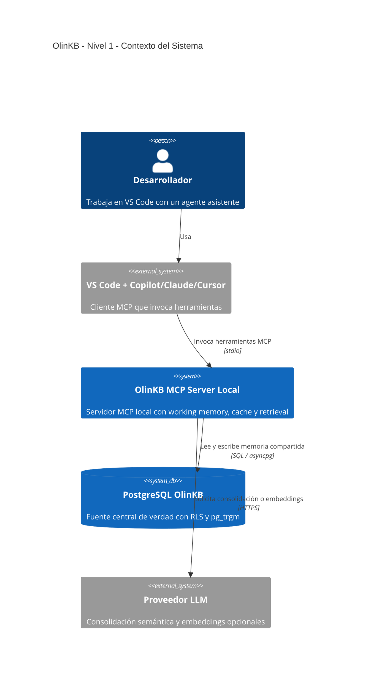
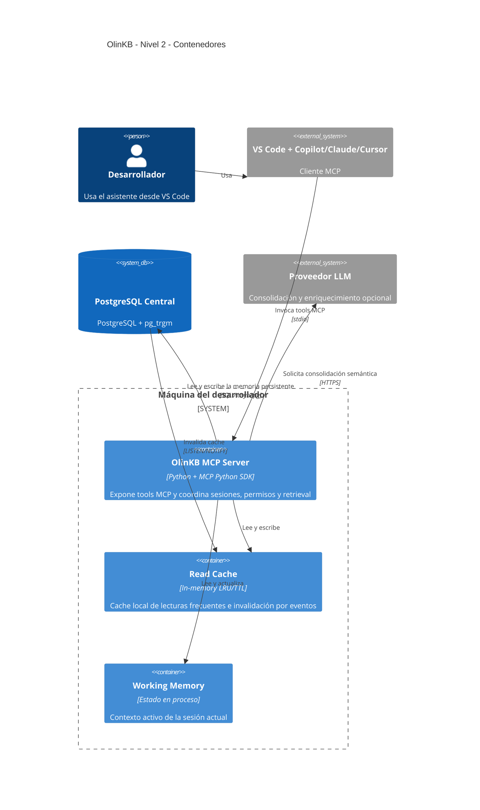
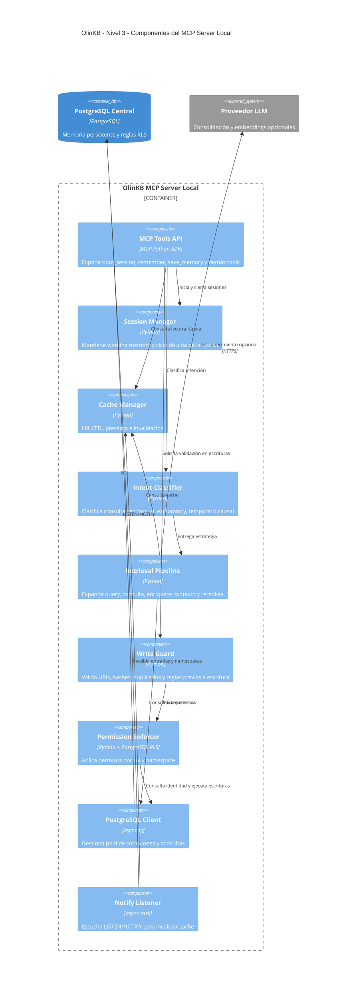
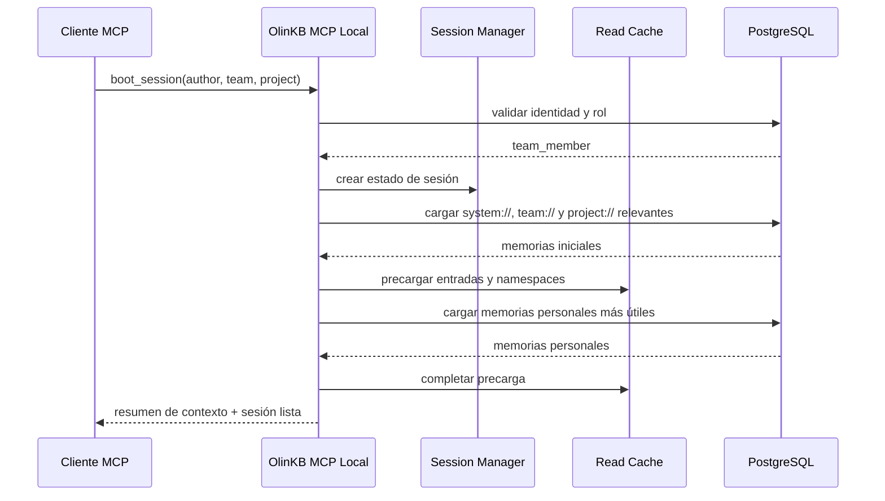
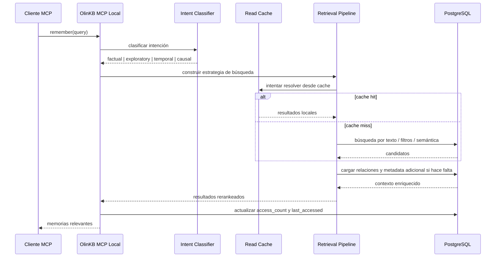
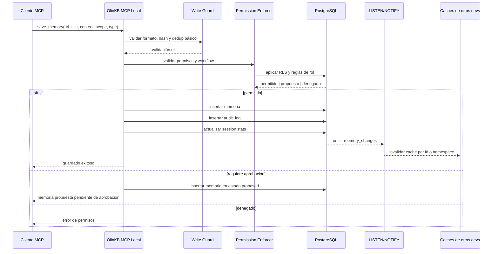

# OlinKB — Arquitectura C4

## Resumen Ejecutivo
OlinKB es una arquitectura de memoria compartida para equipos de desarrollo donde PostgreSQL pasa a ser la fuente única de verdad y cada desarrollador opera mediante un servidor MCP local. Ese servidor local mantiene dos cosas que hacen viable la experiencia diaria: working memory de la sesión y un read cache en memoria para que la mayoría de las lecturas no dependan de la red.

El cambio importante frente a v1 es estructural. v1 servía como memoria personal o para equipos muy pequeños porque SQLite resuelve bien el caso local, pero no el caso multiusuario serio. La arquitectura actual mueve la persistencia compartida a PostgreSQL para ganar concurrencia real, permisos nativos con RLS, auditoría, búsqueda híbrida y una base más sólida para escalar de un equipo pequeño a una organización con varios equipos.

La idea no es crear otro RAG genérico ni otra wiki con embeddings. La idea es construir una memoria de equipo gobernada, consultable por agentes, con separación clara entre memoria personal, de proyecto, de equipo, de organización y de sesión.

## Nota de Fase
En la fase actual, OlinKB se apoya en PostgreSQL oficial más búsqueda textual con `pg_trgm`. La búsqueda semántica con `pgvector` queda explícitamente fuera del runtime actual y se considera una mejora futura para una fase posterior.

## Objetivo del Sistema
OlinKB debe permitir que un agente de desarrollo:

- Recupere decisiones, convenciones y procedimientos del equipo en tiempo real.
- Mantenga working memory local durante la sesión sin inflar la base central.
- Escriba nueva memoria compartida de forma segura, auditable y gobernada.
- Arranque una sesión nueva con contexto útil precargado mediante `boot_session`.
- Escale desde pocos desarrolladores hasta equipos más grandes sin reescribir la arquitectura base.

## Drivers Arquitectónicos
| Driver | Qué obliga a hacer |
|---|---|
| Equipos reales y no un solo dev | PostgreSQL central en lugar de SQLite como storage compartido |
| Baja latencia de lectura | Read cache local con TTL e invalidación |
| Compatibilidad con Copilot/Claude/Cursor | MCP server local por `stdio` |
| Seguridad y gobierno | RLS en PostgreSQL + roles + flujos de aprobación |
| Contexto útil en cada sesión | `boot_session` con precarga de memoria relevante |
| Búsqueda más útil que FTS plano | Retrieval intent-aware con pipeline híbrido |
| Memoria viva y no acumulación infinita | Forgetting engine con decay, TTL y consolidación |
| Observabilidad y trazabilidad | `audit_log`, `sessions`, métricas y accesos |

## Restricciones
| Restricción | Consecuencia |
|---|---|
| PostgreSQL es obligatorio en la arquitectura actual | No hay multi-backend ni sync con otros motores |
| El servidor MCP corre local a cada dev | La experiencia es local, pero las escrituras van al backend central |
| El cache local no es fuente de verdad | Todo write debe llegar a PostgreSQL |
| El modo offline no cubre escritura | Se tolera offline parcial solo para working memory y lecturas cacheadas |
| Embeddings son una mejora de fase posterior | El MVP puede nacer con keyword search y cache |

## Principios de Diseño
1. PostgreSQL es la verdad.
2. El cache acelera, no decide.
3. Los permisos se aplican en la base, no solo en la aplicación.
4. La sesión tiene working memory separada de la memoria persistente.
5. La memoria compartida necesita gobierno, no solo almacenamiento.
6. La búsqueda debe usar intención, no solo coincidencia textual.
7. La memoria debe poder decaer, consolidarse y archivarse.
8. Todo cambio relevante debe quedar auditado.

## C4 — Nivel 1: Contexto del Sistema

### Lectura del Contexto
El desarrollador trabaja en su editor normal. El cliente MCP del editor habla con un proceso local de OlinKB. Ese proceso local no persiste la memoria compartida por sí mismo; consulta y escribe sobre PostgreSQL. El proveedor LLM aparece como dependencia opcional para consolidación semántica, clasificación o embeddings, pero no como núcleo del sistema.

## C4 — Nivel 2: Contenedores

### Lectura de Contenedores
La unidad operativa real está en la máquina del desarrollador. Ahí viven:

- El `OlinKB MCP Server`, que expone las tools.
- La `Working Memory`, que representa el estado efímero de la sesión.
- El `Read Cache`, que reduce viajes repetidos a PostgreSQL.

Fuera de la máquina del desarrollador vive PostgreSQL, que centraliza identidad, memoria, sesiones, grafo, auditoría y políticas. El proveedor LLM queda desacoplado para que el sistema siga siendo útil incluso si la parte semántica está apagada o degradada.

## C4 — Nivel 3: Componentes del MCP Server Local

### Lectura de Componentes
El corazón de la arquitectura está en cómo se separan responsabilidades dentro del servidor local:

- `Session Manager`: conserva el contexto activo de la sesión.
- `Cache Manager`: sirve lecturas rápidas y reacciona a invalidaciones.
- `Intent Classifier`: decide cómo buscar.
- `Retrieval Pipeline`: resuelve la consulta de memoria.
- `Write Guard`: evita basura, conflictos simples y writes peligrosos.
- `Permission Enforcer`: delega la protección final a PostgreSQL con RLS.
- `Notify Listener`: mantiene el caché coherente con lo que hacen otros devs.

## Flujo Operativo: boot_session

### Qué hace realmente `boot_session`
`boot_session` no es solo autenticación. Es el momento en el que el sistema:

- Verifica quién eres.
- Determina qué namespaces y scopes te corresponden.
- Precarga convenciones, decisiones y procedimientos del equipo.
- Precarga contexto del proyecto actual.
- Hidrata working memory con contexto operativo útil.

Ese comportamiento es el que convierte a OlinKB en una herramienta de onboarding automático y no solo en un buscador.

## Flujo Operativo: remember

### Qué hace realmente `remember`
El valor aquí está en que `remember` no trata todas las consultas igual. Algunas preguntas requieren traer una convención exacta; otras necesitan seguir una cadena de decisiones, relaciones o contradicciones. Por eso el retrieval pipeline hace cinco cosas:

1. Clasifica la intención.
2. Expande o filtra la consulta.
3. Consulta cache y luego persistencia.
4. Enriquece con relaciones y metadata.
5. Rerankea según relevancia, frescura, vitalidad y uso.

## Flujo Operativo: save_memory

### Qué hace realmente `save_memory`
Aquí es donde la arquitectura actual se diferencia de una libreta compartida. El write path está gobernado. El sistema valida que la URI tenga sentido, detecta duplicados evidentes, verifica si el autor tiene derecho a escribir en ese namespace y deja un rastro auditable. Si un developer intenta publicar una convención de equipo, puede terminar creando una propuesta en lugar de una memoria activa.

## Modelo de Datos Resumido
### Tabla `team_members`
Define identidad, rol y pertenencia al equipo.

### Tabla `memories`
Es el núcleo de la memoria persistente. Debe contener:

- `uri`
- `title`
- `content`
- `memory_type`
- `scope`
- `namespace`
- `author_id`
- `content_hash`
- `embedding`
- `vitality_score`
- `access_count`
- `last_accessed`
- `expires_at`
- `superseded_by`
- timestamps

### Tabla `memory_links`
Convierte memorias aisladas en un grafo navegable con relaciones como:

- `supersedes`
- `related`
- `contradicts`
- `derived_from`
- `implements`
- `references`

### Tabla `sessions`
Registra el ciclo de vida operativo de cada sesión.

### Tabla `audit_log`
Conserva una historia inmutable de acciones relevantes.

### Tabla `forgetting_policies`
Configura reglas de decay, expiración y consolidación.

## Boundaries y Confianza
### Boundary 1: Máquina del desarrollador
Zona parcialmente confiable. Aquí vive el servidor MCP local y aquí también está el agente, que no debe considerarse plenamente confiable. El cache local acelera lecturas, pero nunca sustituye la protección de PostgreSQL.

### Boundary 2: PostgreSQL central
Zona de confianza fuerte. Aquí se aplican:

- RLS por usuario actual.
- Reglas por scope y namespace.
- Auditoría persistente.
- Políticas de expiración y consolidación.

La seguridad importante no depende del comportamiento del agente ni del cliente MCP, sino de la base central.

## Cómo interactúan las piezas clave
### PostgreSQL
Cumple seis funciones al mismo tiempo:

- Persistencia compartida.
- Identidad y roles.
- Enforzamiento de permisos con RLS.
- Búsqueda full-text y semántica.
- Eventos de invalidación con LISTEN/NOTIFY.
- Soporte para auditoría, sesiones y evolución de memoria.

### Read Cache
Existe para reducir latencia, no para resolver sincronización. Su función es:

- Servir respuestas frecuentes.
- Mantener caliente el contexto de sesión.
- Absorber la mayoría de las lecturas después de `boot_session`.
- Invalidarse rápido cuando PostgreSQL emite cambios.

### Working Memory
Es memoria estrictamente operativa, efímera y de sesión. No debe mezclarse automáticamente con long-term memory. Su función es retener el contexto activo del trabajo actual sin ensuciar la base compartida.

### RLS
Es el fundamento real del modelo multiusuario. Sin RLS, el sistema seguiría dependiendo de checks en aplicación. Con RLS, la propia base rechaza lecturas o escrituras que rompen el modelo de acceso.

### LISTEN/NOTIFY
Es la pieza que evita polling agresivo y permite que el read cache siga siendo útil sin quedar demasiado viejo. Cada write relevante genera una notificación de invalidación.

### Retrieval Pipeline
Es el motor que hace que la memoria sirva para trabajar y no solo para almacenar. Un pipeline razonable para la arquitectura actual es:

1. Clasificación de intención.
2. Expansión o normalización de consulta.
3. Búsqueda keyword y luego semántica.
4. Enriquecimiento con relaciones.
5. Reranking con vitalidad, frescura y uso.

### Forgetting Engine
Su trabajo es mantener la memoria viva. Debe contemplar:

- Decay por tiempo.
- TTL por tipo o scope.
- Consolidación de memorias redundantes.
- Detección de contradicciones.
- Archivado de memorias muertas en vez de borrado inmediato.

## Decisiones Arquitectónicas Clave
### 1. PostgreSQL central en lugar de SQLite compartido
Se eligió porque resuelve concurrencia multiusuario, seguridad y escalabilidad de forma nativa. El costo es mayor complejidad operativa e imposibilidad de escritura offline.

### 2. MCP server local por desarrollador
Se eligió para mantener compatibilidad natural con editores y evitar depender de un servidor HTTP central para cada interacción del asistente. El costo es que cada máquina ejecuta su propio proceso local.

### 3. Cache local en memoria y no sync bidireccional
Se eligió porque reduce la complejidad frente a una arquitectura híbrida con SQLite local más sincronización. El costo es que la experiencia offline es parcial.

### 4. RLS como enforcement y no solo app-layer checks
Se eligió para blindar el modelo de seguridad. El costo es mayor complejidad en schema, testing y debugging.

### 5. Memoria modelada como grafo y no solo como documentos
Se eligió porque las decisiones, convenciones y procedimientos evolucionan y se relacionan. El costo es mayor complejidad de traversal y mantenimiento.

## Riesgos y Mitigaciones
| Riesgo | Impacto | Mitigación |
|---|---|---|
| PostgreSQL caído | Alto | réplica, backups, failover, alertas |
| Invalidation race en cache | Medio | TTL conservador + invalidación por namespace + observabilidad |
| Configuración incorrecta de RLS | Crítico | tests dedicados y fixtures de permisos |
| Consolidación semántica incorrecta | Medio | approval workflow y trazabilidad de merges |
| Exceso de conexiones desde muchos MCP servers | Medio | pooling, límites y tuning temprano |
| Decay demasiado agresivo | Alto | defaults conservadores y tipos exentos |
| Crecimiento del audit log | Medio | particionado o archivado operativo |
| Dependencia fuerte de PG extensions | Medio | estrategia clara de infraestructura y compatibilidad |

## Camino de Implementación Sugerido
### Fase 1: Foundation
Objetivo: tener memoria persistente funcional para un dev con PostgreSQL, cache, `boot_session`, `remember`, `save_memory`, `end_session`.

### Fase 2: Team
Objetivo: introducir roles, RLS, namespaces compartidos, `update_memory`, `forget`, `team_digest` y invalidación en tiempo real.

### Fase 3: Intelligence
Objetivo: activar embeddings, retrieval híbrido completo, consolidación semántica, contradiction detection y analytics.

### Fase 4: Scale
Objetivo: multi-equipo, `org://`, approval workflows completos, import/export, métricas y endurecimiento operativo.

## Lo Que Hace Diferente a OlinKB
1. Tiene gobierno real de memoria, no solo almacenamiento colaborativo.
2. Convierte el arranque de sesión en onboarding automático.
3. Trata la memoria como un grafo evolutivo y no como una lista plana.
4. Usa PostgreSQL como motor de seguridad, no solo como base de datos.
5. Separa working memory de long-term memory de forma explícita.
6. Apunta a equipos reales con varios desarrolladores, no solo a un agente personal.
7. Introduce un forgetting engine como parte del sistema, no como idea futura.
8. Mantiene velocidad local con cache sin caer en una arquitectura de sync difícil de sostener.

## Estado y Siguiente Paso
La arquitectura actual ya queda documentada como operable: contexto, contenedores, componentes, flujos clave, modelo de datos, trust boundaries, decisiones y roadmap.

El siguiente paso natural, si quieres bajar esto a implementación, es definir el esqueleto inicial del repo con:

- estructura de carpetas,
- primeras migraciones PostgreSQL,
- contrato MCP de las 4 tools core,
- y el flujo exacto de `boot_session` y `save_memory` en código.
