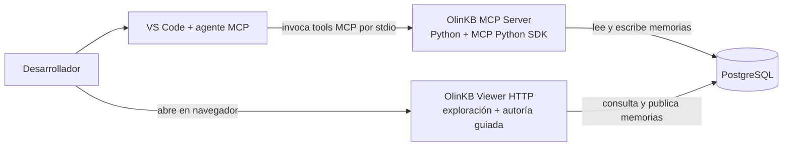
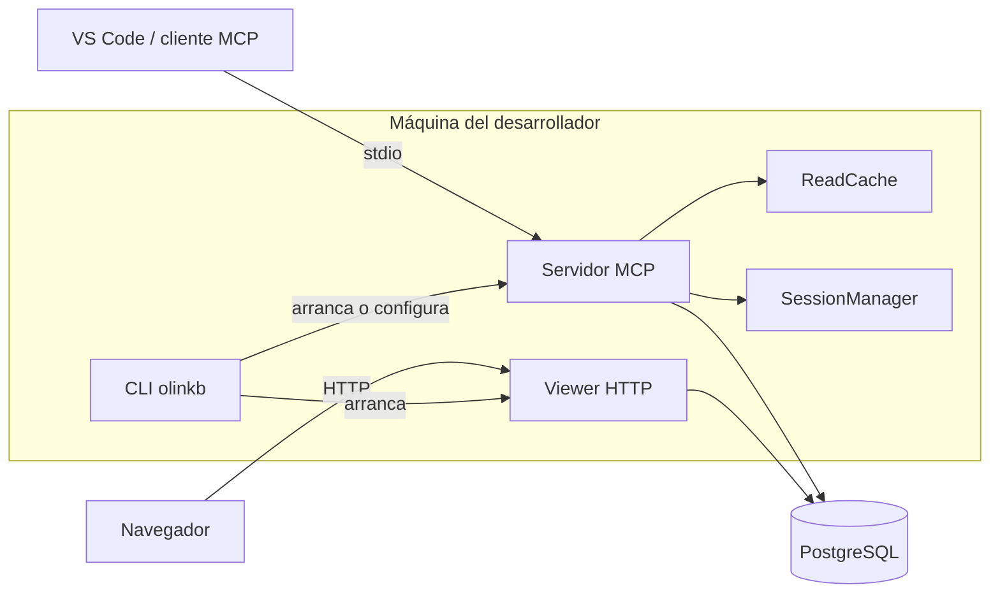
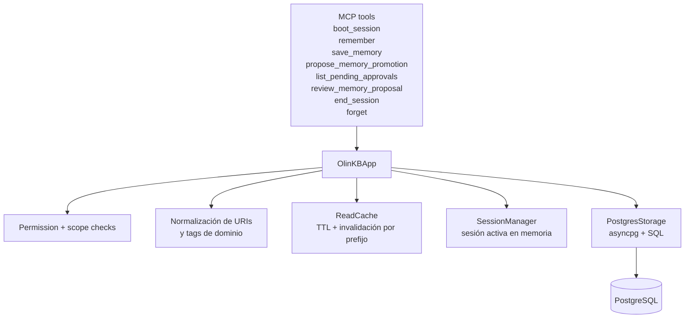
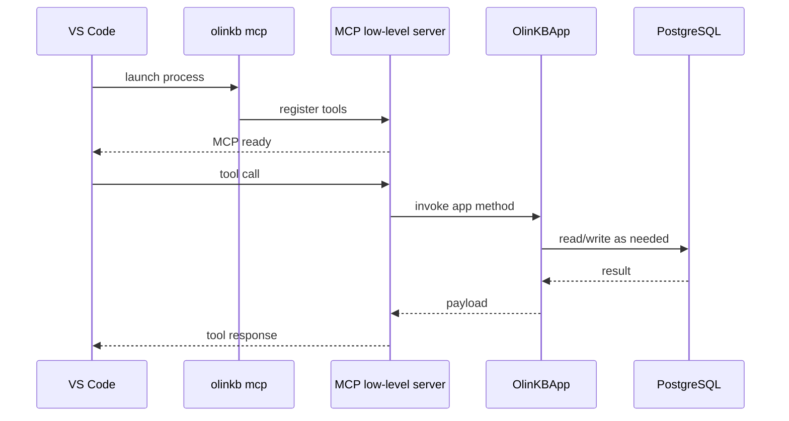
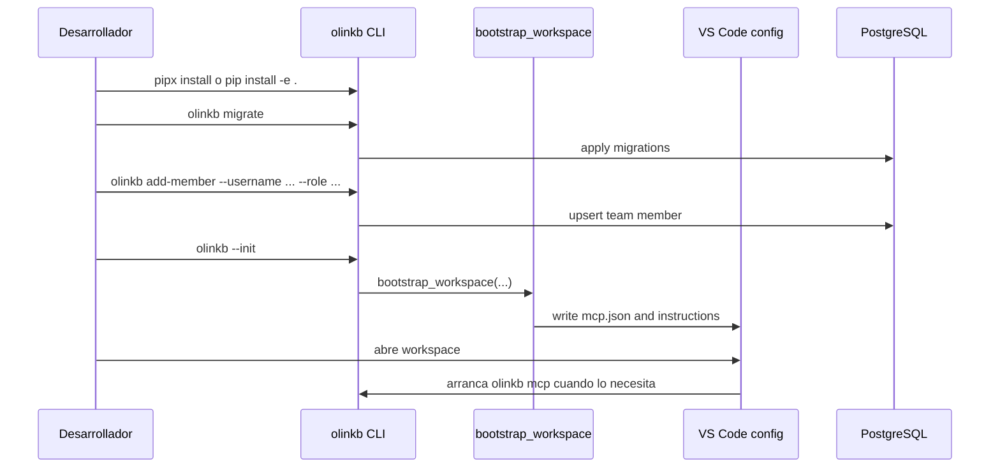
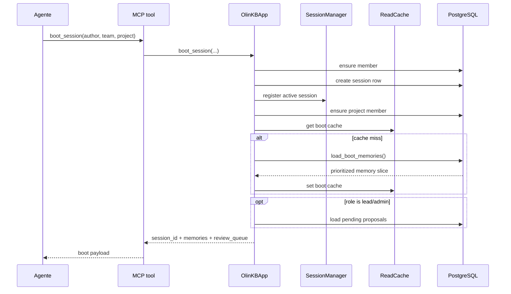
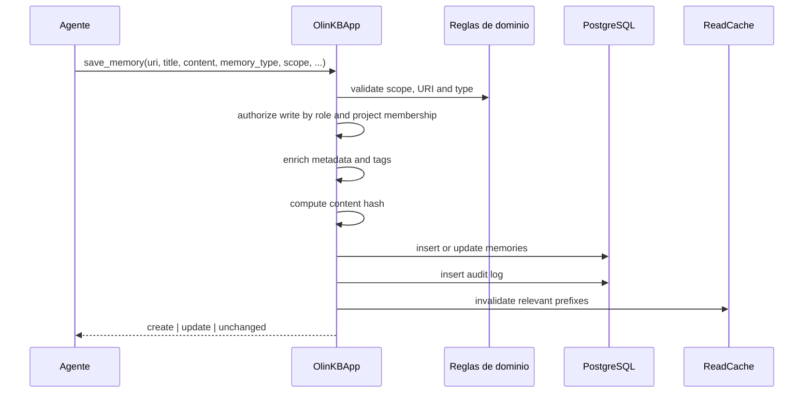
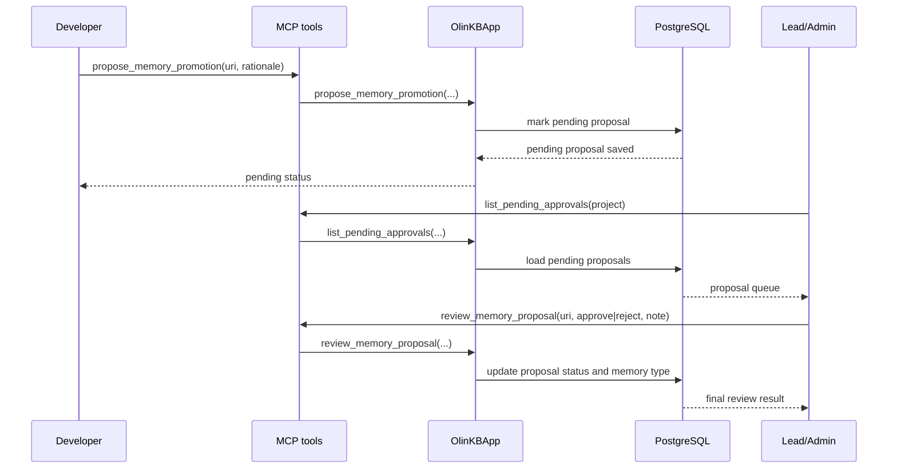
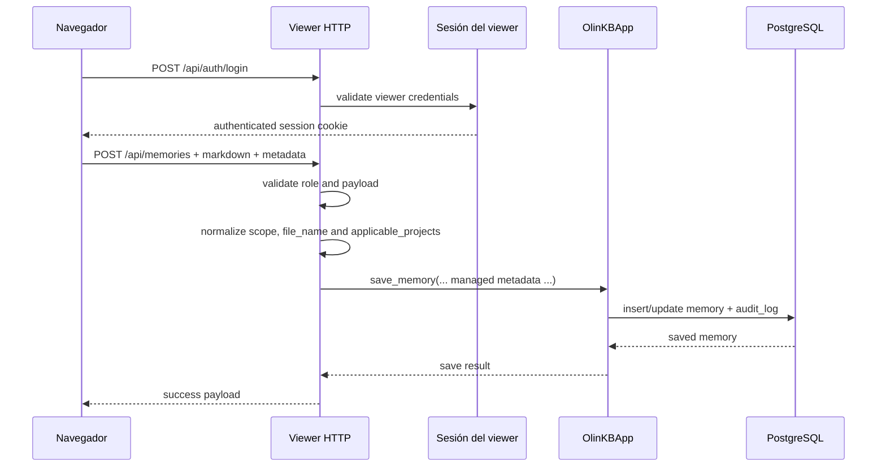
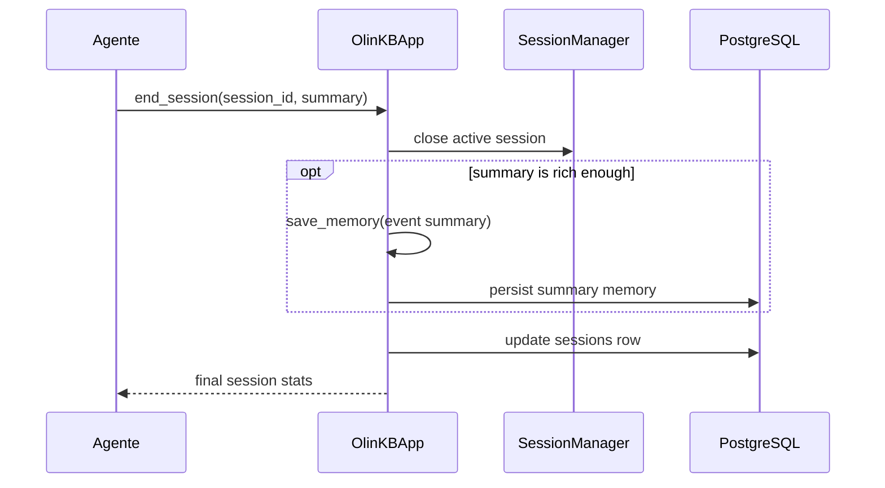

# OlinKB: Funcionamiento End-to-End

Esta guía explica cómo funciona OlinKB de punta a punta: instalación, bootstrap, arranque del servidor MCP, ciclo de vida de sesión, recuperación y actualización de memorias, propuestas de promoción y flujo de documentación técnica o de negocio desde el viewer.

La intención de este documento es ser visual y operativo. No describe solo la idea del sistema, sino el comportamiento real que hoy implementa el código.

## 1. Qué es OlinKB

OlinKB es un servidor MCP local escrito en Python que usa PostgreSQL como almacenamiento persistente para memorias compartidas entre desarrolladores, equipos y proyectos. Se integra con VS Code a través de `stdio`, y además incluye un viewer HTTP opcional para exploración visual y autoría guiada de documentación.

En términos prácticos, el sistema está compuesto por cinco piezas:

1. Un CLI llamado `olinkb` que instala, inicializa y arranca las superficies del sistema.
2. Un servidor MCP que expone herramientas como `boot_session`, `remember`, `save_memory` y `review_memory_proposal`.
3. Una capa de aplicación que valida permisos, coordina sesiones, aplica deduplicación y mantiene caché de lectura.
4. Una base PostgreSQL que persiste memorias, sesiones, miembros, membresías de proyecto y auditoría.
5. Un viewer HTTP opcional que permite explorar la memoria y, con autenticación, subir documentación técnica o de negocio.

## 2. Mapa Rápido del Sistema

| Capa | Responsabilidad | Archivos principales |
| --- | --- | --- |
| CLI y bootstrap | Inicialización de workspace, comandos operativos, viewer | [src/olinkb/cli.py](../src/olinkb/cli.py), [src/olinkb/bootstrap.py](../src/olinkb/bootstrap.py) |
| MCP server | Exposición de herramientas sobre `stdio` | [src/olinkb/server.py](../src/olinkb/server.py) |
| Aplicación | Orquestación, permisos, caché, sesiones | [src/olinkb/app.py](../src/olinkb/app.py), [src/olinkb/session.py](../src/olinkb/session.py) |
| Dominio | Tipos, scopes, URIs, tags, reglas de validación | [src/olinkb/domain.py](../src/olinkb/domain.py) |
| Persistencia | Pool PostgreSQL, queries, auditoría, búsquedas | [src/olinkb/storage/postgres.py](../src/olinkb/storage/postgres.py) |
| Caché | LRU con TTL y limpieza por prefijo | [src/olinkb/storage/cache.py](../src/olinkb/storage/cache.py) |
| Viewer HTTP | API visual, login del viewer, subida de documentación | [src/olinkb/viewer_server.py](../src/olinkb/viewer_server.py), [src/olinkb/viewer.py](../src/olinkb/viewer.py) |
| Configuración | Variables `OLINKB_*` y defaults | [src/olinkb/config.py](../src/olinkb/config.py) |
| Esquema SQL | Tablas, índices y evolución de schema | [src/olinkb/storage/migrations](../src/olinkb/storage/migrations) |

## 3. Arquitectura Visual

### 3.1 C4 Nivel 1: Contexto



### 3.2 C4 Nivel 2: Contenedores



### 3.3 C4 Nivel 3: Componentes del Servidor MCP



## 4. Instalación e Inicialización

Hay dos caminos habituales para usar OlinKB.

### 4.1 Instalación desde release

Si se usa como herramienta instalada para VS Code, el entrypoint publicado es `olinkb` y está definido en [pyproject.toml](../pyproject.toml).

```bash
pipx install https://github.com/rzjulio/olinkb/releases/download/v0.1.0/olinkb-0.1.0-py3-none-any.whl
```

### 4.2 Instalación desde el repositorio

Para desarrollo local del proyecto:

```bash
python -m venv .venv
source .venv/bin/activate
pip install -e .
```

El script de consola registrado es:

```toml
[project.scripts]
olinkb = "olinkb.cli:main"
```

### 4.3 Base de datos local

El repositorio incluye ayuda para levantar PostgreSQL localmente:

```bash
docker compose -f docker/docker-compose.yml up -d
```

Luego se necesitan al menos estas variables:

```bash
export OLINKB_PG_URL='postgresql://...'
export OLINKB_TEAM='mi-equipo'
export OLINKB_USER='tu-usuario'
```

Opcionales útiles:

- `OLINKB_PROJECT`
- `OLINKB_CACHE_TTL_SECONDS`
- `OLINKB_CACHE_MAX_ENTRIES`
- `OLINKB_PG_POOL_MAX_SIZE`

### 4.4 Bootstrap del workspace

El bootstrap interactivo se hace con:

```bash
olinkb --init
```

Ese flujo pasa por [src/olinkb/bootstrap.py](../src/olinkb/bootstrap.py) y genera o actualiza la configuración MCP de VS Code.

Dependiendo del scope elegido:

- `repository`: escribe `.vscode/mcp.json` y `.github/copilot-instructions.md`.
- `global`: escribe la configuración global de VS Code.

Además, el CLI deja preparado el directorio `olinkb-viewer/` para el viewer.

### 4.5 Migraciones y membresías

Antes de trabajar en serio, el esquema debe existir y los miembros deben estar cargados:

```bash
olinkb migrate
olinkb add-member --username rzjulio --role admin
```

La parte importante de este paso es que OlinKB no solo necesita una base, también necesita saber quién pertenece al equipo y con qué rol.

## 5. Qué Arranca Realmente el CLI

El CLI expone varios modos en [src/olinkb/cli.py](../src/olinkb/cli.py):

- `olinkb serve`
- `olinkb mcp`
- `olinkb migrate`
- `olinkb add-member`
- `olinkb viewer`
- `olinkb viewer build`
- `olinkb template mcp`

Los más importantes para entender el sistema son:

- `olinkb mcp`: arranca el servidor MCP sobre `stdio`.
- `olinkb viewer`: arranca el viewer HTTP vivo, por defecto en `127.0.0.1:8123`.
- `olinkb viewer build`: exporta un snapshot estático a `olinkb-viewer/index.html`.

## 6. Cómo Empieza a Trabajar el MCP

Cuando VS Code detecta el servidor en `mcp.json`, no habla con PostgreSQL directamente. Lo que hace es lanzar el comando `olinkb mcp` como subproceso local.

Ese proceso carga [src/olinkb/server.py](../src/olinkb/server.py), registra las tools del SDK oficial de MCP y delega el comportamiento real a una instancia de `OlinKBApp`.

### 6.1 Herramientas MCP expuestas hoy

El código actual expone estas herramientas públicas:

1. `boot_session`
2. `remember`
3. `save_memory`
4. `propose_memory_promotion`
5. `list_pending_approvals`
6. `review_memory_proposal`
7. `end_session`
8. `forget`

Es importante remarcar algo: hoy no existen herramientas MCP específicas llamadas `create_managed_memory`, `update_managed_memory`, `list_managed_memories` o `archive_managed_memory`. La documentación gestionada se crea usando `save_memory` con tipos especiales o a través del viewer HTTP.

### 6.2 Secuencia de arranque MCP



## 7. Flujo Completo: Desde Instalar hasta Tener Contexto Útil

### 7.1 Secuencia de instalación e inicialización



### 7.2 Qué pasa después de `boot_session`

`boot_session` es el punto donde el sistema deja de ser solo infraestructura y pasa a entregar contexto útil al usuario o al agente.

## 8. `boot_session`: Cómo Se Inicializa una Sesión de Trabajo

La lógica vive principalmente en [src/olinkb/app.py](../src/olinkb/app.py) y [src/olinkb/storage/postgres.py](../src/olinkb/storage/postgres.py).

El flujo real es:

1. Resolver `author`, `team` y `project` usando parámetros explícitos o defaults de configuración.
2. Asegurar que el miembro existe en `team_members`.
3. Crear la sesión en la tabla `sessions`.
4. Registrar la sesión activa en memoria con `SessionManager`.
5. Si hay proyecto, asegurar la membresía en `project_members`.
6. Buscar en caché las memorias de bootstrap.
7. Si no están en caché, cargar memorias desde PostgreSQL.
8. Si el rol es `lead` o `admin`, cargar también propuestas pendientes para review.

### 8.1 Qué memorias carga hoy el boot

El código actual de [src/olinkb/storage/postgres.py](../src/olinkb/storage/postgres.py) carga por prefijos de URI, en este orden:

1. `system://%`
2. `team://conventions/%`
3. `project://{project}/%`
4. `personal://{username}/%`

Luego ordena por prioridad de prefijo y por `updated_at DESC`.

### 8.2 Punto importante sobre el boot

Aunque el README menciona una intención más selectiva para `development_standard`, el código actual no filtra por `memory_type` en `load_boot_memories`. Eso significa que la precarga hoy depende del prefijo URI y no del tipo de memoria.

En otras palabras:

- Si una `documentation` vive bajo `project://...`, hoy puede entrar al boot.
- Si una `business_documentation` vive bajo un prefijo que coincide, también puede entrar.
- `development_standard` no tiene una ruta especial de prioridad en el código actual.

### 8.3 Secuencia de boot



## 9. `remember`: Cómo el Usuario Empieza a Recibir Memorias

El usuario no recibe todas las memorias del sistema. OlinKB opera como una combinación de precarga inicial más recuperación bajo demanda.

`remember` hace eso.

El flujo real es:

1. Resolver el contexto de identidad desde `session_id` o configuración.
2. Construir una clave de caché con query, scope e identidad.
3. Consultar la caché.
4. Si no hay hit, ejecutar búsqueda en PostgreSQL.
5. Mezclar resultados de memorias con resúmenes de sesiones recientes.
6. Marcar acceso a las memorias encontradas para incrementar `retrieval_count`.

### 9.1 Cómo busca realmente

La búsqueda no usa embeddings. Usa `pg_trgm` y similitud textual, con expansión de términos sobre:

- `title`
- `content`
- `uri`
- `memory_type`
- `tags`
- `metadata::text`

Eso permite que preguntas naturales como “documentación técnica global” coincidan no solo por texto literal, sino también por tags enriquecidos o metadata serializada.

### 9.2 Secuencia de `remember`


## 10. `save_memory`: Crear o Actualizar una Memoria

`save_memory` es el punto de entrada general para escribir memoria. Sirve tanto para crear como para actualizar.

La diferencia depende del URI:

- Si el URI no existe, se inserta.
- Si el URI ya existe, se actualiza.
- Si el contenido nuevo produce el mismo hash y la misma metadata, devuelve `unchanged`.

### 10.1 Qué valida antes de escribir

Antes de tocar PostgreSQL, la aplicación valida:

1. Que el `scope` coincida con el URI.
2. Que el `memory_type` sea válido.
3. Que el usuario tenga permisos para escribir ese scope y ese tipo.
4. Que el namespace del URI sea consistente.

### 10.2 Qué hace durante la escritura

Después de la validación:

1. Normaliza metadata.
2. Extrae estructura útil de `content` si hace falta.
3. Enriquece tags a partir de tipo y metadata.
4. Calcula `content_hash` SHA256.
5. Inserta o actualiza en `memories`.
6. Inserta una fila en `audit_log`.
7. Invalida cachés `boot:*` y `remember:*` relacionadas.
8. Incrementa contadores de la sesión activa.

### 10.3 Secuencia de escritura



## 11. Qué Permite Cada Rol

La autorización real vive en [src/olinkb/app.py](../src/olinkb/app.py).

| Acción | Developer | Lead | Admin | Viewer |
| --- | --- | --- | --- | --- |
| Guardar memoria personal propia | Sí | Sí | Sí | No |
| Guardar memoria de proyecto regular | Sí | Sí | Sí | No |
| Guardar `documentation` de proyecto | Sí | Sí | Sí | No |
| Guardar `development_standard` de proyecto | Sí | Sí | Sí | No |
| Guardar `business_documentation` | No | No | Sí | No |
| Guardar `convention` directamente en proyecto | No | Sí | Sí | No |
| Revisar propuestas pendientes | No | Sí | Sí | No |

### 11.1 Matiz importante

En la superficie MCP genérica, un contribuyente de proyecto puede guardar `documentation` o `development_standard` bajo scope `project` si tiene permisos de escritura de proyecto. En cambio, el viewer HTTP actual restringe la autoría visual a `lead` y `admin`.

Eso quiere decir que hoy existen dos superficies con reglas cercanas, pero no idénticas:

- MCP genérico: más flexible para `project` scope.
- Viewer HTTP: explícitamente curado para autoría aprobadora.

## 12. `propose_memory_promotion`: Sugerir que una Memoria Sea Revisada

Esta herramienta no convierte una memoria en documentación técnica. Su propósito real es enviar una memoria de proyecto existente a revisión para promoción.

### 12.1 Qué hace hoy

1. Toma una memoria existente por `uri`.
2. Exige que sea una memoria de `project`.
3. Marca la memoria como `pending`.
4. Guarda quién propuso el cambio y por qué.
5. La deja lista para review por un `lead` o `admin`.

### 12.2 Restricción importante

Aunque el mensaje de error menciona “convention or standard”, el normalizador actual colapsa `standard` en `convention`. Es decir: el flujo de promoción actual es un flujo práctico hacia `convention`, no hacia `documentation` ni hacia un `development_standard` separado.

### 12.3 Secuencia de propuesta y review



## 13. Cómo Se Actualiza una Memoria Existente

Actualizar una memoria no requiere una API distinta. OlinKB usa el mismo `save_memory` y considera actualización cuando el URI ya existe.

La semántica es esta:

1. Mismo URI.
2. Nuevo contenido o nueva metadata.
3. Se conserva la identidad conceptual de la memoria.
4. Se genera auditoría con `old_content` y `new_content`.

Esto es importante porque el modelo mental correcto en OlinKB no es “editar por id interno”, sino “volver a guardar la memoria de la misma dirección lógica”.

## 14. Documentación Gestionada: Qué Es y Cómo Funciona Hoy

OlinKB usa estos tipos relevantes para documentación gestionada:

- `documentation`: documentación técnica o de ingeniería.
- `business_documentation`: documentación de negocio, restringida a admins.
- `development_standard`: estándar de ingeniería persistente.

### 14.1 Qué significa “gestionada” en la práctica

Hoy “managed memory” significa principalmente tres cosas:

1. Tiene un `memory_type` especial.
2. Lleva metadata estructurada como `documentation_scope`, `applicable_projects` y `content_format`.
3. Se le enriquecen tags automáticamente para mejorar su descubrimiento.

No significa todavía que exista una API MCP dedicada completa o una tabla de targets activamente poblada y usada en cada flujo.

### 14.2 Cómo se crean hoy estas memorias

Hay dos caminos reales:

1. `save_memory(...)` desde MCP, usando `memory_type=documentation`, `business_documentation` o `development_standard`.
2. El viewer HTTP, que permite subir un archivo Markdown y crear una memoria curada.

## 15. Cómo Admins y Leads Suben Documentación Técnica o de Negocio en el Viewer

La superficie visual vive en [src/olinkb/viewer.py](../src/olinkb/viewer.py) y [src/olinkb/viewer_server.py](../src/olinkb/viewer_server.py).

### 15.1 Qué ofrece hoy el viewer

El viewer vivo (`olinkb viewer`) habilita lectura pública y autoría autenticada.

En la UI actual:

- Hay botón de `Sign in`.
- El composer se habilita solo si la sesión del viewer puede gestionar documentación.
- El formulario permite elegir:
  - `Title`
  - `Scope`: `Global` o `By repo`
  - `Documentation type`: `Technical documentation` o `Business documentation`
  - Archivo Markdown a subir
- Si el scope es `By repo`, se eligen uno o varios repos aplicables.

### 15.2 Qué tipos permite el viewer

El viewer actual permite crear únicamente:

- `documentation`
- `business_documentation`

No expone creación visual de `development_standard`.

### 15.3 Cómo normaliza el viewer la memoria

Antes de llamar a `save_memory`, el backend HTTP:

1. Valida título, contenido, tipo y target scope.
2. Rechaza `business_documentation` si el rol no es `admin`.
3. Decide el scope persistido:
   - `global` se guarda como scope `org` con clave `shared`.
   - `repo` con un único proyecto se guarda como scope `project`.
   - `repo` con varios proyectos mantiene memoria compartida con metadata de aplicabilidad.
4. Construye metadata como:
   - `managed: true`
   - `authoring_surface: viewer`
   - `content_format: markdown`
   - `documentation_scope: global|repo`
   - `applicable_projects: [...]`
   - `source_file_name` si se sube archivo
5. Genera un URI a partir del título y el scope.

### 15.4 Secuencia de autoría en el viewer



### 15.5 Diferencia entre documentación técnica y de negocio

La diferencia actual no es solo semántica, también es de permisos:

- `documentation`: disponible en el viewer para `lead` y `admin`.
- `business_documentation`: disponible solo para `admin`.

## 16. Qué Pasa con `development_standard`

`development_standard` existe como `memory_type` válido y puede persistirse con `save_memory`, pero hoy no tiene una superficie visual dedicada en el viewer.

Por eso conviene pensar su flujo actual así:

- Se crea principalmente por MCP o por flujos internos de aplicación.
- Puede vivir como memoria durable y ser recuperado por `remember`.
- El boot actual no lo trata con una prioridad especial en SQL, aunque documentos más viejos lo describan así.

## 17. Diferencia Entre “Sugerir una Memoria” y “Crear Documentación Técnica”

Este punto es clave para evitar confusiones de uso.

### 17.1 Sugerir una memoria

Se hace con `propose_memory_promotion`.

Sirve para:

- tomar una memoria existente de proyecto,
- enviarla a review,
- y eventualmente promoverla a una convención aprobada.

No sirve hoy para convertir una memoria cualquiera en `documentation` ni para subir documentación de negocio.

### 17.2 Crear documentación técnica o de negocio

Se hace hoy por:

- `save_memory` con `memory_type` especial, o
- el viewer HTTP autenticado.

Eso significa que “promoción” y “documentación gestionada” son flujos distintos en el código actual.

## 18. Modelo de Datos Persistente

Las tablas más importantes son:

| Tabla | Propósito |
| --- | --- |
| `team_members` | identidad y rol del usuario |
| `project_members` | rol del usuario dentro de un proyecto |
| `memories` | unidad principal de conocimiento |
| `sessions` | historial de sesiones de trabajo |
| `audit_log` | trazabilidad de cambios |
| `schema_migrations` | control de migraciones |
| `managed_memory_targets` | tabla pensada para targets gestionados |

### 18.1 Qué guarda `memories`

`memories` concentra lo esencial:

- URI lógica
- título
- contenido
- tipo de memoria
- scope
- namespace
- autor
- tags
- `content_hash`
- metadata JSONB
- timestamps
- soft delete

### 18.2 Auditoría

Cada cambio importante deja rastro en `audit_log`. Eso permite reconstruir quién creó, actualizó, olvidó o propuso una memoria.

## 19. `end_session`: Cómo se Cierra el Trabajo

Cuando termina una sesión relevante, `end_session`:

1. Cierra la sesión activa en `SessionManager`.
2. Actualiza `sessions` en PostgreSQL con resumen, `ended_at`, contadores de lectura y escritura.
3. Dependiendo del contenido del resumen, puede persistir también el resumen como memoria de tipo `event`.

### 19.1 Secuencia de cierre



## 20. Limitaciones y Gaps Importantes del Estado Actual

Este documento debe dejar claro qué existe y qué todavía no está completo.

### 20.1 Superficies MCP faltantes para memoria gestionada

Hoy no hay herramientas MCP dedicadas para:

- crear memoria gestionada,
- actualizarla,
- listarla,
- archivarla.

El sistema usa `save_memory` genérico para creación/actualización y `forget` para archivado lógico.

### 20.2 `managed_memory_targets` existe, pero no gobierna el flujo principal

La migración [src/olinkb/storage/migrations/005_add_managed_memory_support.sql](../src/olinkb/storage/migrations/005_add_managed_memory_support.sql) define `managed_memory_targets`, pero la ruta principal de escritura actual sigue descansando sobre `memory_type`, metadata y tags enriquecidos.

Por lo tanto, la forma real de entender la aplicabilidad hoy es:

- metadata: `documentation_scope`
- metadata: `applicable_projects`
- tags derivados

y no una resolución fuerte desde una API MCP de targets gestionados.

### 20.3 Divergencia entre documentación y código

Hay documentos del repositorio que describen una visión más pulida del flujo de managed memory. El código actual, en cambio, conserva una realidad más simple:

- promoción hacia convención por un lado,
- documentación gestionada por `save_memory` o viewer por otro,
- y boot todavía basado en prefijos URI.

Cuando haya duda, este documento prioriza el comportamiento implementado hoy.

## 21. Mapa Mental de Uso Correcto

Si un usuario quiere hacer esto, la ruta real es esta:

| Necesidad | Flujo recomendado hoy |
| --- | --- |
| Iniciar sesión de trabajo y cargar contexto | `boot_session` |
| Buscar memorias relevantes | `remember` |
| Guardar hallazgo, decisión o bugfix | `save_memory` |
| Actualizar una memoria existente | `save_memory` con el mismo URI |
| Sugerir que una memoria del proyecto sea revisada | `propose_memory_promotion` |
| Aprobar o rechazar la sugerencia | `review_memory_proposal` |
| Subir documentación técnica en forma visual | `olinkb viewer` + login + composer |
| Subir documentación de negocio | viewer con `admin`, o `save_memory` con `business_documentation` |
| Cerrar la sesión de trabajo | `end_session` |

## 22. Archivos Clave para Seguir Profundizando

- [src/olinkb/cli.py](../src/olinkb/cli.py): comandos reales y entrypoints.
- [src/olinkb/bootstrap.py](../src/olinkb/bootstrap.py): bootstrap del workspace y configuración MCP.
- [src/olinkb/server.py](../src/olinkb/server.py): definición exacta de tools MCP.
- [src/olinkb/app.py](../src/olinkb/app.py): reglas de autorización y orquestación principal.
- [src/olinkb/domain.py](../src/olinkb/domain.py): tipos válidos, scopes, roles y tags automáticos.
- [src/olinkb/storage/postgres.py](../src/olinkb/storage/postgres.py): SQL real de boot, search, save, forget y proposals.
- [src/olinkb/viewer_server.py](../src/olinkb/viewer_server.py): login del viewer y publicación de documentación.
- [src/olinkb/viewer.py](../src/olinkb/viewer.py): interfaz visual, composer y recorrido de autoría.
- [docs/DEVELOPER-GUIDE.md](./DEVELOPER-GUIDE.md): setup operativo complementario.
- [docs/olinkb-arquitectura-c4.md](./olinkb-arquitectura-c4.md): material arquitectónico ya existente.

## 23. Resumen Ejecutivo

OlinKB funciona hoy como una combinación de servidor MCP local, caché de lectura, capa de aplicación y PostgreSQL como fuente de verdad. La experiencia del usuario se construye sobre dos momentos:

1. `boot_session`, que abre el contexto inicial y precarga memorias por prefijo de URI.
2. `remember`, que recupera memoria bajo demanda con ranking textual, tags y metadata.

Para escritura, `save_memory` sigue siendo la pieza central. Para promoción, existe un flujo de propuesta y revisión. Para documentación técnica o de negocio, la subida más visual y controlada ocurre hoy en el viewer HTTP, con login y formulario Markdown para `lead` y `admin`, y restricción adicional a `admin` para documentación de negocio.

La arquitectura ya es suficientemente funcional para operar, pero todavía conserva diferencias entre lo idealizado en algunos documentos y lo que hoy implementa el código. Precisamente por eso este documento debe servir como referencia de operación real.