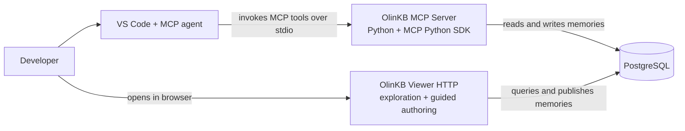
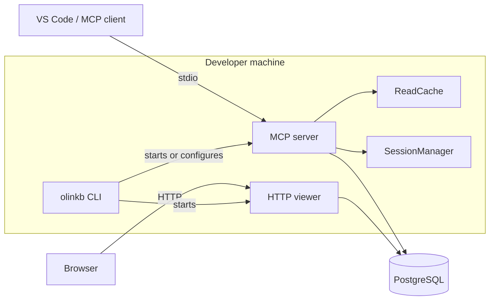
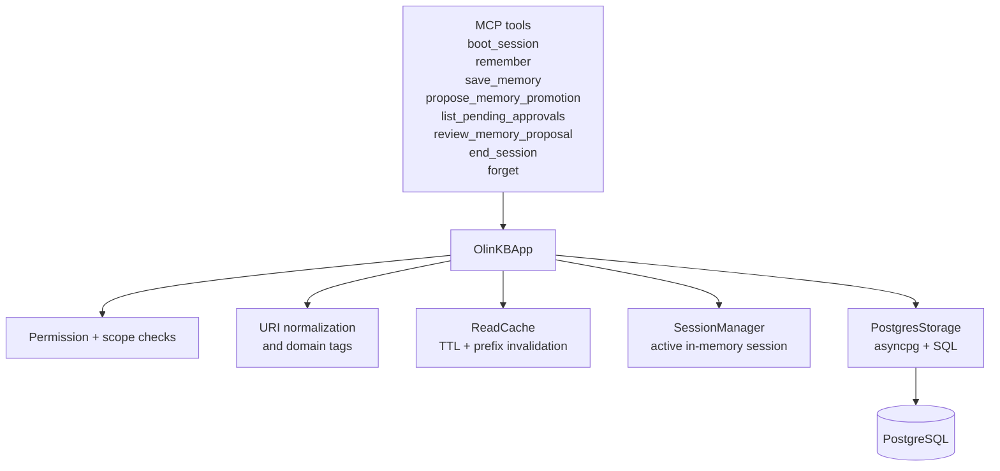
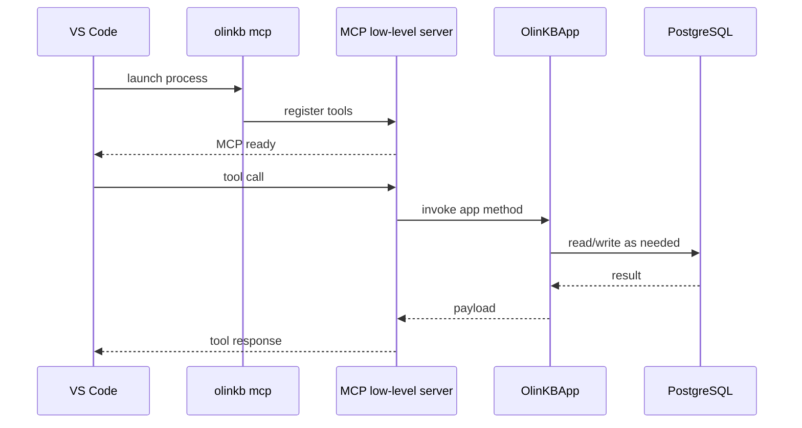
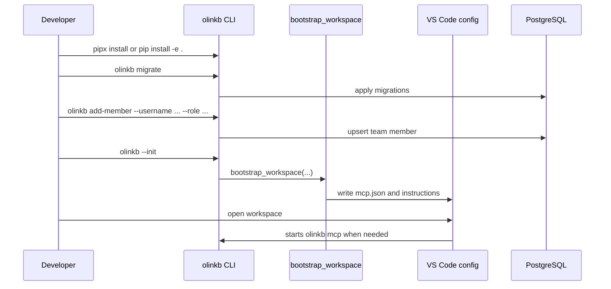
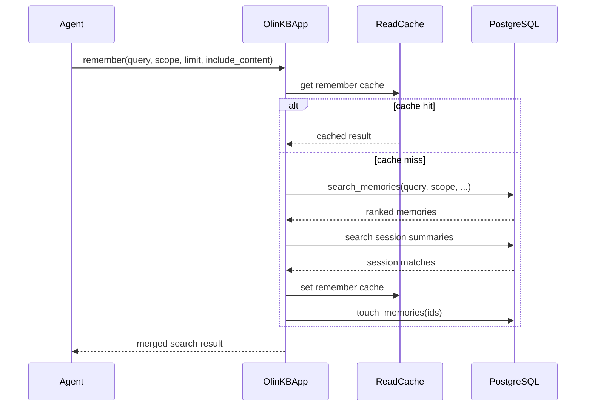
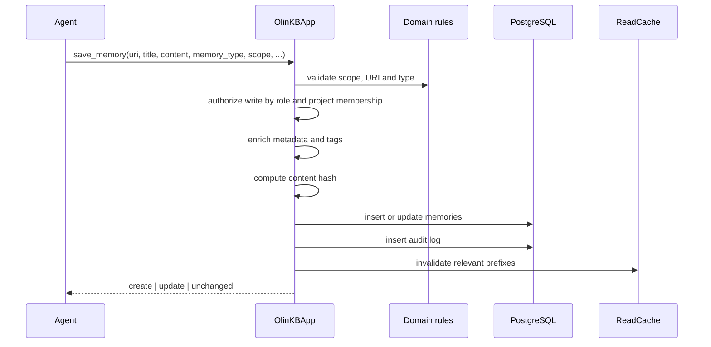
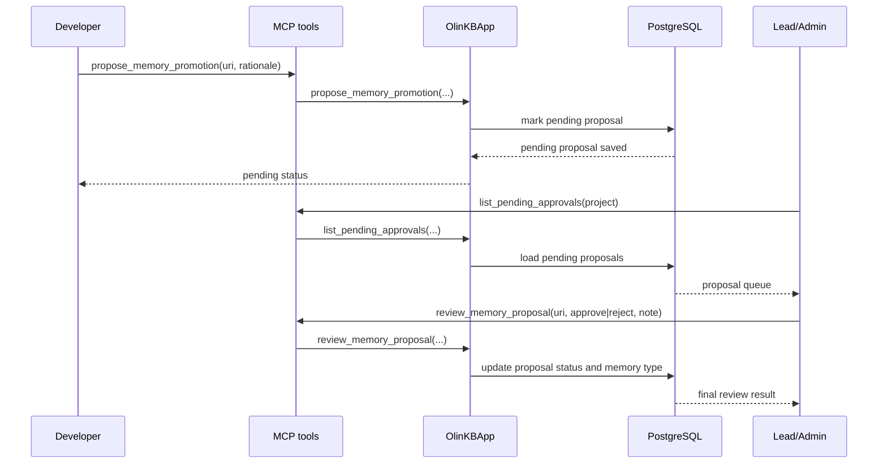
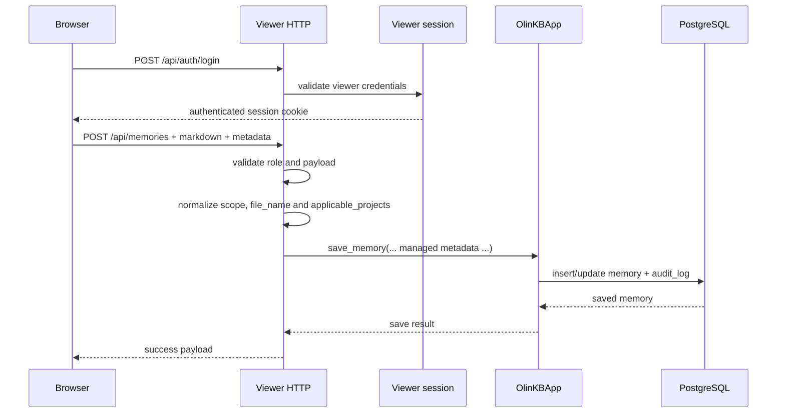
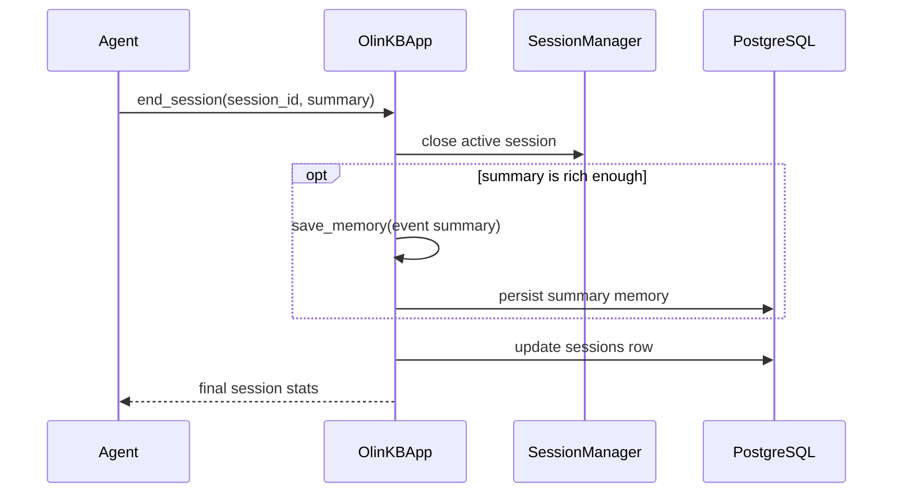

# OlinKB: End-to-End Operation

This guide explains how OlinKB works end to end: installation, bootstrap, MCP server startup, session lifecycle, memory retrieval and updates, promotion proposals, and the flow for technical or business documentation through the viewer.

The goal of this document is to be visual and operational. It does not describe only the idea of the system, but the real behavior the code currently implements.

## 1. What OlinKB Is

OlinKB is a local MCP server written in Python that uses PostgreSQL as persistent storage for shared memories across developers, teams, and projects. It integrates with VS Code through `stdio`, and also includes an optional HTTP viewer for visual exploration and guided documentation authoring.

In practical terms, the system is composed of five pieces:

1. A CLI called `olinkb` that installs, initializes, and starts the system surfaces.
2. An MCP server that exposes tools such as `boot_session`, `remember`, `save_memory`, and `review_memory_proposal`.
3. An application layer that validates permissions, coordinates sessions, applies deduplication, and maintains a read cache.
4. A PostgreSQL database that persists memories, sessions, members, project memberships, and audit data.
5. An optional HTTP viewer that allows memory exploration and, with authentication, uploading technical or business documentation.

## 2. Quick System Map

| Layer | Responsibility | Main files |
| --- | --- | --- |
| CLI and bootstrap | Workspace initialization, operational commands, viewer | [src/olinkb/cli.py](../src/olinkb/cli.py), [src/olinkb/bootstrap.py](../src/olinkb/bootstrap.py) |
| MCP server | Tool exposure over `stdio` | [src/olinkb/server.py](../src/olinkb/server.py) |
| Application | Orchestration, permissions, cache, sessions | [src/olinkb/app.py](../src/olinkb/app.py), [src/olinkb/session.py](../src/olinkb/session.py) |
| Domain | Types, scopes, URIs, tags, validation rules | [src/olinkb/domain.py](../src/olinkb/domain.py) |
| Persistence | PostgreSQL pool, queries, audit, searches | [src/olinkb/storage/postgres.py](../src/olinkb/storage/postgres.py) |
| Cache | LRU with TTL and prefix-based cleanup | [src/olinkb/storage/cache.py](../src/olinkb/storage/cache.py) |
| HTTP viewer | Visual API, viewer login, documentation upload | [src/olinkb/viewer_server.py](../src/olinkb/viewer_server.py), [src/olinkb/viewer.py](../src/olinkb/viewer.py) |
| Configuration | `OLINKB_*` variables and defaults | [src/olinkb/config.py](../src/olinkb/config.py) |
| SQL schema | Tables, indexes, and schema evolution | [src/olinkb/storage/migrations](../src/olinkb/storage/migrations) |

## 3. Visual Architecture

### 3.1 C4 Level 1: Context



### 3.2 C4 Level 2: Containers



### 3.3 C4 Level 3: MCP Server Components



## 4. Installation and Initialization

There are two common ways to use OlinKB.

### 4.1 Installation from a release

If it is used as an installed tool for VS Code, the published entrypoint is `olinkb` and it is defined in [pyproject.toml](../pyproject.toml).

```bash
pipx install https://github.com/rzjulio/olinkb/releases/download/v0.1.0/olinkb-0.1.0-py3-none-any.whl
```

### 4.2 Installation from the repository

For local project development:

```bash
python -m venv .venv
source .venv/bin/activate
pip install -e .
```

The registered console script is:

```toml
[project.scripts]
olinkb = "olinkb.cli:main"
```

### 4.3 Local database

The repository includes help for bringing up local PostgreSQL:

```bash
docker compose -f docker/docker-compose.yml up -d
```

At minimum, these variables are then required:

```bash
export OLINKB_PG_URL='postgresql://...'
export OLINKB_TEAM='my-team'
export OLINKB_USER='your-username'
```

Useful optional ones:

- `OLINKB_PROJECT`
- `OLINKB_CACHE_TTL_SECONDS`
- `OLINKB_CACHE_MAX_ENTRIES`
- `OLINKB_PG_POOL_MAX_SIZE`

### 4.4 Workspace bootstrap

Interactive bootstrap is done with:

```bash
olinkb --init
```

That flow goes through [src/olinkb/bootstrap.py](../src/olinkb/bootstrap.py) and generates or updates the VS Code MCP configuration.

Depending on the selected scope:

- `repository`: writes `.vscode/mcp.json` and `.github/copilot-instructions.md`.
- `global`: writes global VS Code configuration.

In addition, the CLI prepares the `olinkb-viewer/` directory for the viewer.

### 4.5 Migrations and memberships

Before serious work begins, the schema must exist and members must be loaded:

```bash
olinkb migrate
olinkb add-member --username rzjulio --role admin
```

The important part of this step is that OlinKB does not only need a database; it also needs to know who belongs to the team and with which role.

## 5. What the CLI Actually Starts

The CLI exposes several modes in [src/olinkb/cli.py](../src/olinkb/cli.py):

- `olinkb serve`
- `olinkb mcp`
- `olinkb migrate`
- `olinkb add-member`
- `olinkb viewer`
- `olinkb viewer build`
- `olinkb template mcp`

The most important ones for understanding the system are:

- `olinkb mcp`: starts the MCP server over `stdio`.
- `olinkb viewer`: starts the live HTTP viewer, by default on `127.0.0.1:8123`.
- `olinkb viewer build`: exports a static snapshot to `olinkb-viewer/index.html`.

## 6. How MCP Starts Working

When VS Code detects the server in `mcp.json`, it does not talk to PostgreSQL directly. What it does is launch the `olinkb mcp` command as a local subprocess.

That process loads [src/olinkb/server.py](../src/olinkb/server.py), registers tools from the official MCP SDK, and delegates real behavior to an `OlinKBApp` instance.

### 6.1 MCP tools exposed today

The current code exposes these public tools:

1. `boot_session`
2. `remember`
3. `save_memory`
4. `propose_memory_promotion`
5. `list_pending_approvals`
6. `review_memory_proposal`
7. `end_session`
8. `forget`

It is important to call out one thing: today there are no specific MCP tools called `create_managed_memory`, `update_managed_memory`, `list_managed_memories`, or `archive_managed_memory`. Managed documentation is created through `save_memory` with special types or through the HTTP viewer.

### 6.2 MCP startup sequence



## 7. Complete Flow: From Installation to Useful Context

### 7.1 Installation and initialization sequence



### 7.2 What happens after `boot_session`

`boot_session` is the point where the system stops being only infrastructure and starts delivering useful context to the user or the agent.

## 8. `boot_session`: How a Work Session Is Initialized

The logic lives mainly in [src/olinkb/app.py](../src/olinkb/app.py) and [src/olinkb/storage/postgres.py](../src/olinkb/storage/postgres.py).

The real flow is:

1. Resolve `author`, `team`, and `project` using explicit parameters or configuration defaults.
2. Ensure the member exists in `team_members`.
3. Create the session in the `sessions` table.
4. Register the active session in memory with `SessionManager`.
5. If there is a project, ensure membership in `project_members`.
6. Look up bootstrap memories in cache.
7. If they are not in cache, load memories from PostgreSQL.
8. If the role is `lead` or `admin`, also load pending proposals for review.

### 8.1 Which memories boot loads today

The current code in [src/olinkb/storage/postgres.py](../src/olinkb/storage/postgres.py) loads by URI prefixes, in this order:

1. `system://%`
2. `team://conventions/%`
3. `project://{project}/%`
4. `personal://{username}/%`

It then sorts by prefix priority and by `updated_at DESC`.

### 8.2 Important point about boot

Although the README mentions a more selective intention for `development_standard`, the current code does not filter by `memory_type` in `load_boot_memories`. That means preload currently depends on URI prefix rather than memory type.

In other words:

- If a `documentation` memory lives under `project://...`, it can currently enter boot.
- If a `business_documentation` memory lives under a matching prefix, it can also enter boot.
- `development_standard` has no special priority path in the current code.

### 8.3 Boot sequence


## 9. `remember`: How the User Starts Receiving Memories

The user does not receive all memories in the system. OlinKB operates as a combination of initial preload plus on-demand retrieval.

`remember` does that.

The real flow is:

1. Resolve identity context from `session_id` or configuration.
2. Build a cache key with query, scope, and identity.
3. Check the cache.
4. If there is no hit, run a PostgreSQL search.
5. Merge memory results with recent session summaries.
6. Mark access to found memories to increase `retrieval_count`.

### 9.1 How it actually searches

The search does not use embeddings. It uses `pg_trgm` and textual similarity, with term expansion across:

- `title`
- `content`
- `uri`
- `memory_type`
- `tags`
- `metadata::text`

That allows natural questions like "global technical documentation" to match not only by literal text, but also by enriched tags or serialized metadata.

### 9.2 `remember` sequence



## 10. `save_memory`: Create or Update a Memory

`save_memory` is the general entry point for writing memory. It serves both creation and update.

The difference depends on the URI:

- If the URI does not exist, it inserts.
- If the URI already exists, it updates.
- If the new content produces the same hash and the same metadata, it returns `unchanged`.

### 10.1 What it validates before writing

Before touching PostgreSQL, the application validates:

1. That `scope` matches the URI.
2. That `memory_type` is valid.
3. That the user has permission to write that scope and type.
4. That the URI namespace is consistent.

### 10.2 What it does during the write

After validation:

1. Normalize metadata.
2. Extract useful structure from `content` when needed.
3. Enrich tags from type and metadata.
4. Compute SHA256 `content_hash`.
5. Insert or update in `memories`.
6. Insert a row in `audit_log`.
7. Invalidate related `boot:*` and `remember:*` caches.
8. Increment active session counters.

### 10.3 Write sequence



## 11. What Each Role Can Do

Real authorization lives in [src/olinkb/app.py](../src/olinkb/app.py).

| Action | Developer | Lead | Admin | Viewer |
| --- | --- | --- | --- | --- |
| Save own personal memory | Yes | Yes | Yes | No |
| Save regular project memory | Yes | Yes | Yes | No |
| Save project `documentation` | Yes | Yes | Yes | No |
| Save project `development_standard` | Yes | Yes | Yes | No |
| Save `business_documentation` | No | No | Yes | No |
| Save `convention` directly in project | No | Yes | Yes | No |
| Review pending proposals | No | Yes | Yes | No |

### 11.1 Important nuance

On the generic MCP surface, a project contributor can save `documentation` or `development_standard` under `project` scope if they have project write permission. By contrast, the current HTTP viewer restricts visual authoring to `lead` and `admin`.

That means there are currently two surfaces with similar but not identical rules:

- Generic MCP: more flexible for `project` scope.
- HTTP viewer: explicitly curated for approval-capable authoring.

## 12. `propose_memory_promotion`: Suggest That a Memory Be Reviewed

This tool does not turn a memory into technical documentation. Its real purpose is to send an existing project memory into review for promotion.

### 12.1 What it does today

1. Takes an existing memory by `uri`.
2. Requires it to be a `project` memory.
3. Marks the memory as `pending`.
4. Stores who proposed the change and why.
5. Leaves it ready for review by a `lead` or `admin`.

### 12.2 Important restriction

Although the error message mentions "convention or standard", the current normalizer collapses `standard` into `convention`. In other words, the current promotion flow is practically a flow toward `convention`, not toward `documentation` or a separate `development_standard`.

### 12.3 Proposal and review sequence



## 13. How an Existing Memory Is Updated

Updating a memory does not require a different API. OlinKB uses the same `save_memory` and considers it an update when the URI already exists.

The semantics are:

1. Same URI.
2. New content or new metadata.
3. The conceptual identity of the memory is preserved.
4. Audit data is generated with `old_content` and `new_content`.

This matters because the correct mental model in OlinKB is not "edit by internal id", but "save the memory again at the same logical address".

## 14. Managed Documentation: What It Is and How It Works Today

OlinKB uses these relevant types for managed documentation:

- `documentation`: technical or engineering documentation.
- `business_documentation`: business documentation, restricted to admins.
- `development_standard`: persistent engineering standard.

### 14.1 What "managed" means in practice

Today, "managed memory" mainly means three things:

1. It has a special `memory_type`.
2. It carries structured metadata such as `documentation_scope`, `applicable_projects`, and `content_format`.
3. Its tags are enriched automatically to improve discovery.

It does not yet mean that there is a full dedicated MCP API or a target table actively populated and used in every flow.

### 14.2 How these memories are created today

There are two real paths:

1. `save_memory(...)` from MCP, using `memory_type=documentation`, `business_documentation`, or `development_standard`.
2. The HTTP viewer, which lets you upload a Markdown file and create a curated memory.

## 15. How Admins and Leads Upload Technical or Business Documentation in the Viewer

The visual surface lives in [src/olinkb/viewer.py](../src/olinkb/viewer.py) and [src/olinkb/viewer_server.py](../src/olinkb/viewer_server.py).

### 15.1 What the viewer offers today

The live viewer (`olinkb viewer`) enables public reading and authenticated authoring.

In the current UI:

- There is a `Sign in` button.
- The composer is enabled only if the viewer session can manage documentation.
- The form lets you choose:
  - `Title`
  - `Scope`: `Global` or `By repo`
  - `Documentation type`: `Technical documentation` or `Business documentation`
  - Markdown file to upload
- If the scope is `By repo`, one or more applicable repositories are selected.

### 15.2 Which types the viewer allows

The current viewer allows creating only:

- `documentation`
- `business_documentation`

It does not expose visual creation of `development_standard`.

### 15.3 How the viewer normalizes the memory

Before calling `save_memory`, the HTTP backend:

1. Validates title, content, type, and target scope.
2. Rejects `business_documentation` if the role is not `admin`.
3. Decides the persisted scope:
   - `global` is stored as `org` scope with key `shared`.
   - `repo` with a single project is stored as `project` scope.
   - `repo` with several projects keeps shared memory with applicability metadata.
4. Builds metadata such as:
   - `managed: true`
   - `authoring_surface: viewer`
   - `content_format: markdown`
   - `documentation_scope: global|repo`
   - `applicable_projects: [...]`
   - `source_file_name` if a file is uploaded
5. Generates a URI from the title and scope.

### 15.4 Viewer authoring sequence



### 15.5 Difference between technical and business documentation

The current difference is not only semantic, but also about permissions:

- `documentation`: available in the viewer for `lead` and `admin`.
- `business_documentation`: available only for `admin`.

## 16. What Happens with `development_standard`

`development_standard` exists as a valid `memory_type` and can be persisted with `save_memory`, but today it does not have a dedicated visual surface in the viewer.

So it is better to think of its current flow like this:

- It is created mainly through MCP or internal application flows.
- It can live as durable memory and be retrieved by `remember`.
- Current boot does not give it special priority in SQL, even if older documents describe it that way.

## 17. Difference Between "Suggesting a Memory" and "Creating Technical Documentation"

This point is key to avoid usage confusion.

### 17.1 Suggesting a memory

This is done with `propose_memory_promotion`.

It serves to:

- take an existing project memory,
- send it to review,
- and eventually promote it to an approved convention.

It does not currently serve to convert an arbitrary memory into `documentation` or to upload business documentation.

### 17.2 Creating technical or business documentation

Today this is done through:

- `save_memory` with a special `memory_type`, or
- the authenticated HTTP viewer.

That means "promotion" and "managed documentation" are distinct flows in the current code.

## 18. Persistent Data Model

The most important tables are:

| Table | Purpose |
| --- | --- |
| `team_members` | user identity and role |
| `project_members` | user's role within a project |
| `memories` | main unit of knowledge |
| `sessions` | history of work sessions |
| `audit_log` | change traceability |
| `schema_migrations` | migration control |
| `managed_memory_targets` | table intended for managed targets |

### 18.1 What `memories` stores

`memories` concentrates the essentials:

- logical URI
- title
- content
- memory type
- scope
- namespace
- author
- tags
- `content_hash`
- JSONB metadata
- timestamps
- soft delete

### 18.2 Audit

Each important change leaves a trace in `audit_log`. That makes it possible to reconstruct who created, updated, forgot, or proposed a memory.

## 19. `end_session`: How Work Is Closed

When a relevant session ends, `end_session`:

1. Closes the active session in `SessionManager`.
2. Updates `sessions` in PostgreSQL with summary, `ended_at`, and read/write counters.
3. Depending on the summary content, may also persist the summary as an `event` memory.

### 19.1 Closing sequence



## 20. Important Limitations and Gaps in the Current State

This document should make clear what exists and what is still incomplete.

### 20.1 Missing MCP surfaces for managed memory

Today there are no dedicated MCP tools for:

- creating managed memory,
- updating it,
- listing it,
- archiving it.

The system uses generic `save_memory` for creation and updates, and `forget` for logical archiving.

### 20.2 `managed_memory_targets` exists, but does not govern the main flow

The migration [src/olinkb/storage/migrations/005_add_managed_memory_support.sql](../src/olinkb/storage/migrations/005_add_managed_memory_support.sql) defines `managed_memory_targets`, but the current main write path still relies on `memory_type`, metadata, and enriched tags.

Therefore, the real way to understand applicability today is:

- metadata: `documentation_scope`
- metadata: `applicable_projects`
- derived tags

and not a strong resolution through an MCP API for managed targets.

### 20.3 Divergence between documentation and code

Some repository documents describe a more polished managed-memory flow. The current code, by contrast, keeps a simpler reality:

- promotion toward convention on one side,
- managed documentation through `save_memory` or viewer on the other,
- and boot still based on URI prefixes.

When there is doubt, this document prioritizes currently implemented behavior.

## 21. Correct-Use Mental Map

If a user wants to do one of these things, the real path is this:

| Need | Recommended flow today |
| --- | --- |
| Start a work session and load context | `boot_session` |
| Search for relevant memories | `remember` |
| Save a finding, decision, or bugfix | `save_memory` |
| Update an existing memory | `save_memory` with the same URI |
| Suggest that a project memory be reviewed | `propose_memory_promotion` |
| Approve or reject the suggestion | `review_memory_proposal` |
| Upload technical documentation visually | `olinkb viewer` + login + composer |
| Upload business documentation | viewer as `admin`, or `save_memory` with `business_documentation` |
| Close the work session | `end_session` |

## 22. Key Files for Going Deeper

- [src/olinkb/cli.py](../src/olinkb/cli.py): real commands and entrypoints.
- [src/olinkb/bootstrap.py](../src/olinkb/bootstrap.py): workspace bootstrap and MCP configuration.
- [src/olinkb/server.py](../src/olinkb/server.py): exact definition of MCP tools.
- [src/olinkb/app.py](../src/olinkb/app.py): authorization rules and main orchestration.
- [src/olinkb/domain.py](../src/olinkb/domain.py): valid types, scopes, roles, and automatic tags.
- [src/olinkb/storage/postgres.py](../src/olinkb/storage/postgres.py): the real SQL for boot, search, save, forget, and proposals.
- [src/olinkb/viewer_server.py](../src/olinkb/viewer_server.py): viewer login and documentation publishing.
- [src/olinkb/viewer.py](../src/olinkb/viewer.py): visual interface, composer, and authoring flow.
- [docs/DEVELOPER-GUIDE.md](./DEVELOPER-GUIDE.md): complementary operational setup.
- [docs/olinkb-arquitectura-c4.md](./olinkb-arquitectura-c4.md): existing architectural material.

## 23. Executive Summary

OlinKB currently operates as a combination of a local MCP server, read cache, application layer, and PostgreSQL as the source of truth. The user experience is built around two moments:

1. `boot_session`, which opens initial context and preloads memories by URI prefix.
2. `remember`, which retrieves memory on demand using textual ranking, tags, and metadata.

For writing, `save_memory` remains the central piece. For promotion, there is a proposal-and-review flow. For technical or business documentation, the most visual and controlled upload path currently happens in the HTTP viewer, with login and a Markdown form for `lead` and `admin`, plus an additional `admin` restriction for business documentation.

The architecture is already functional enough to operate, but it still preserves differences between what some documents idealize and what the code currently implements. That is precisely why this document should serve as a reference for real operation.